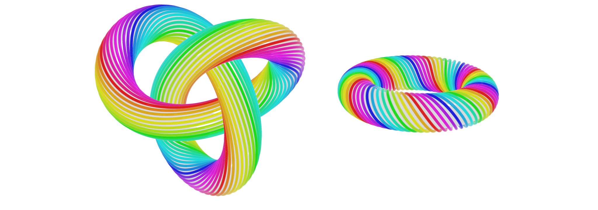
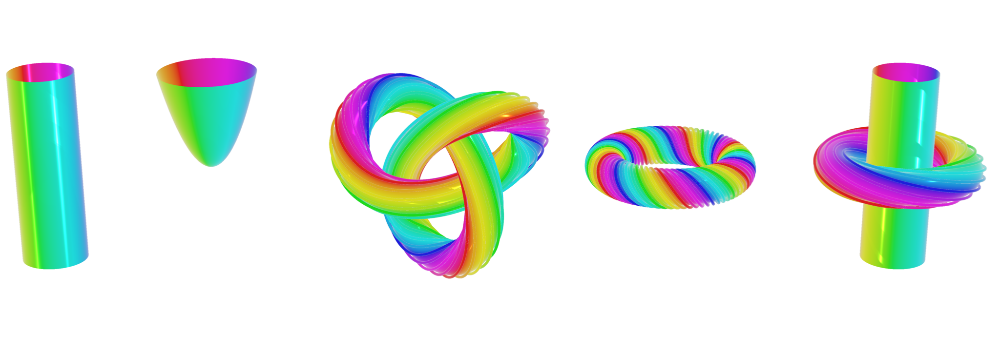
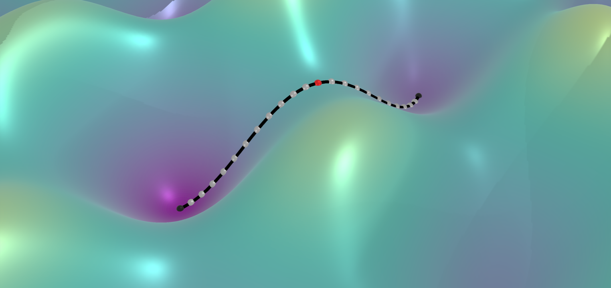

# Hopfion illustrations
Some Hopfion illustrations with pyvista.

# Examples

Fig.1: Two Hopfions with charge H=6

Fig.2: More objects in 3D. From left to right: skyrmion tube, bobber, trefoil hopfion with H=6, toroidal hopfion with H=6, toroidal hopfion on a skyrmion tube.

Fig.3: MEP path on a toy 2D energy surface.
